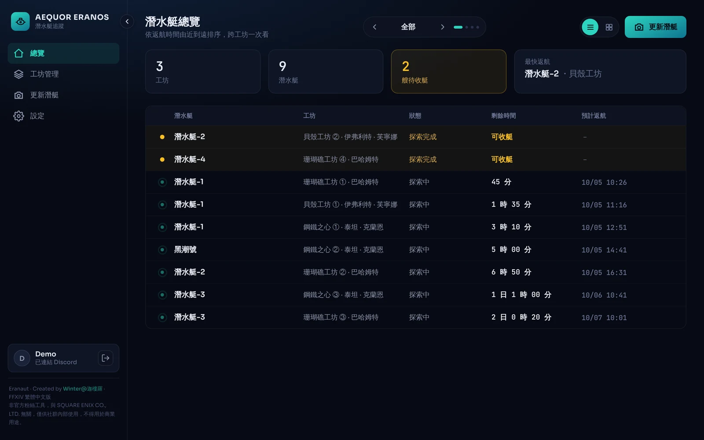
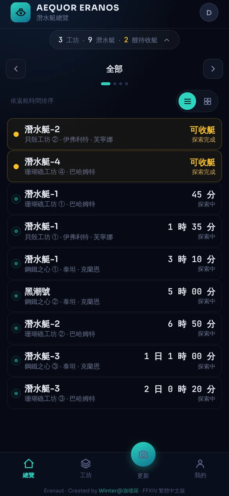
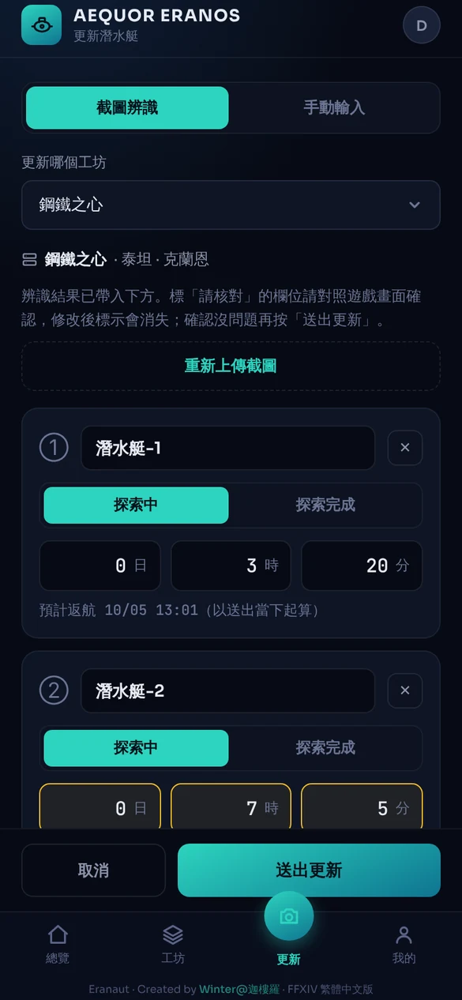
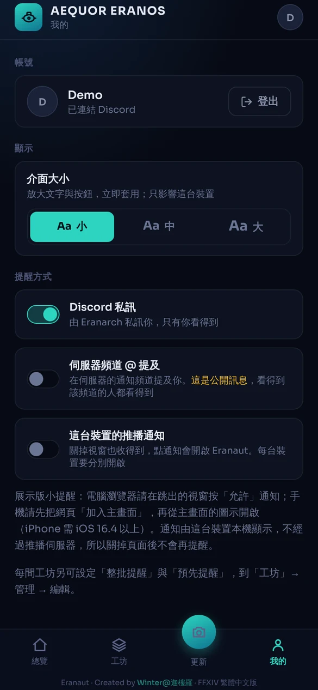
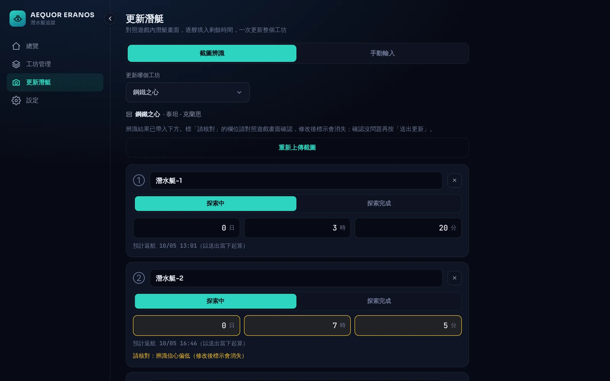

# Eranaut

**繁體中文** · [English](README.en.md)

> 一個可安裝的 **PWA + Fastify API**,用來追蹤 FFXIV 潛水艇在多間工坊的返航時間:Discord 登入、Discord / 瀏覽器推播提醒、自架 OCR 辨識遊戲截圖。為一個約 128 人的 Discord 社群而做,並實際在使用。

[](./LICENSE)
[](https://nodejs.org)
[](https://angular.dev)
[](https://fastify.dev)

### 👉 [線上試玩:demo.eranaut.aequoreranos.com](https://demo.eranaut.aequoreranos.com/)

免登入、資料是假的、只存在你的瀏覽器。畫面就是正式版的 Angular 前端(換成假後端),可以新增工坊、上傳任何圖片試「截圖辨識」(會回傳固定的示範結果)、在設定頁開啟通知並傳送測試通知。手機請先「加入主畫面」再開啟。說明見[展示模式](#展示模式)。



<table>
  <tr>
    <td></td>
    <td></td>
    <td></td>
  </tr>
  <tr>
    <td align="center">總覽</td>
    <td align="center">辨識結果核對</td>
    <td align="center">設定與提醒方式</td>
  </tr>
</table>



## 這是什麼

FFXIV(Final Fantasy XIV)的潛水艇探索要等好幾小時到好幾天,有多間工坊、每間多艘艇的玩家很容易忘記收艇。Eranaut 讓社群成員記錄自己名下的工坊與每艘艇的返航時間,在返航前收到提醒。

這個 repo 是**正式版的前端加後端 monorepo**(含完整開發歷史),目前部署在一台 Mac mini 上供社群成員使用。配套的 Discord bot 是另一個專案:[`eranarch-bot`](https://github.com/VisyLockhart/eranarch-bot)。

## 功能

- **Discord OAuth2 登入**,並以 bot 查詢公會成員與身份組決定誰有資格使用(規則可寫成 AND / OR 組合,如 `A+B,C`)。
- **總覽**:所有工坊與潛水艇依返航時間排序,倒數與「最快返航」;清單與卡片兩種檢視,可依工坊過濾。
- **工坊管理**:新增、編輯、刪除,拖曳與按鈕排序(滑鼠與觸控)。
- **更新潛艇**:手動輸入,或上傳 / 貼上 / 擷取遊戲截圖交給自架 OCR 辨識,辨識結果逐艘核對後再送出;信心偏低的欄位會標示「請核對」。
- **提醒**:Discord 私訊、伺服器頻道 @、瀏覽器推播(Web Push)三種方式可複選;每間工坊可設定提前幾分鐘,或整批一次提醒。
- **航線模擬**:在海域地圖上選航點,算出航行時間、返航時刻與燃料;依等級與距離上限即時反灰選不了的航點;編輯配件配置(10⁴ 種組合)並對照路線需求;「找路線」可用必選 / 排除航點、海域、最長航行時間、想要的物品與排序(每分鐘經驗、可能解鎖、最多物品)篩出路線,或反過來找出達標的配件組合。配置與找路線的條件都可命名儲存並跨裝置同步(「條件組合」),配置可綁定多艘工坊潛艇。資料集為第三方整理,**不適用 MIT**(見文末授權)。
- **PWA**:可加到手機主畫面;service worker 只快取 app shell,API 一律走網路。
- **介面**:純深色主題、手機與桌機兩套版面、小 / 中 / 大三種介面大小、手機統計區與桌機側欄可收合、手機下拉重新整理。

## 技術亮點

想快速了解做過哪些工程上的取捨,可以從這幾點看起(完整脈絡在 [`docs/ARCHITECTURE.md`](docs/ARCHITECTURE.md)):

- **自架 OCR,不連外部服務**:PP-OCRv4 跑在 API 同一個 process,圖片只在記憶體處理、不落地;辨識解析器是純函式,針對已知的誤認模式設計,**不確定就標為可疑而不是猜**。並限制同時辨識的張數,超過就排隊,再超過回 429。
- **提醒不靠外部佇列**:待發提醒存 SQLite,API 進程內每 30 秒輪詢;以潛艇為鍵 upsert,資料量有上限、不需要清理排程。重試、永久失敗與「過期不補發」都有明確規則。
- **一個資料入口**:Discord bot 也呼叫同一支 API(內部埠、共用密鑰),不直接開 SQLite。
- **認證從簡單處下手**:伺服器端 session cookie(DB 只存雜湊)、`SameSite=Lax`、同網域所以不需要 CORS、Origin 檢查。每個「沒做」(JWT、CSRF token、PKCE)都記錄了原因。
- **資格規則只定義一處**:網站登入、每日比對、bot 指令共用同一個判斷函式;失去資格只標記停用、不刪資料,且 Discord 取不到名單時整次比對放棄,避免誤停所有人。
- **Web Push 按裝置訂閱**:一筆提醒發給使用者所有裝置,失效訂閱自動清除;處理了 iOS 必須加入主畫面才有推播的限制。
- **展示模式**:同一份 Angular 程式碼,用建置時的 `fileReplacements` 換上假的 `HttpBackend`,正式版 bundle 不含任何展示程式碼。
- **航線計算是純函式**:選取判斷、最短順序、配置搜尋、路線推薦都在不依賴 Angular 的 `route/core/`,資料集打包進 lazy chunk(可離線),功能以注入的 `ROUTE_FEATURES` 開關控制(展示版關掉儲存、綁定與條件組合)。
- **測試**:後端用 Node.js 內建的 `node:test`(含 OCR 解析、提醒發送與重試、資格比對、認證等),前端約 560 項單元測試。

## 展示模式

[線上展示版](https://demo.eranaut.aequoreranos.com/)不是另外寫的頁面,而是**同一份前端**加上一個建置時才啟用的假後端:

- 在 Angular 依賴注入換掉 `HttpBackend`,由 `DemoBackend` 攔截所有 `/api/*` 請求,畫面與其他程式碼完全不動。假後端仿照真實 API 的驗證與錯誤格式,資料存在瀏覽器的 `localStorage`。
- 用 `fileReplacements` 在 `demo` 建置組態切換,所以正式版 bundle 不含展示程式碼。
- 右下角的「展示模式」標籤可重設資料、登出看迎賓頁,或直接看各種登入失敗畫面。
- 展示版**沒有**的:真實 Discord 登入、真實 OCR(回傳固定的示範結果)、真實推播排程(「傳送測試通知」由本機 service worker 顯示,外觀與正式版一樣)。
- **航線模擬**在展示版可以完整試用,但**不提供儲存配置、綁定工坊潛艇與儲存條件組合**(都需要登入與伺服器端的資料表):配置與找路線的條件只留在這個瀏覽器的畫面上,「重設資料」會一併清掉。做法是 `ROUTE_FEATURES` 注入權杖,展示組態把 `saving` 設為 `false`,畫面隱藏相關按鈕與「條件組合」列、`RouteVm` 與 `RouteFilterVm` 也不呼叫 `/api/route-subs`、`/api/route-filters`。

本機建置展示版(需先建置 shared):

```bash
npm install
npm run build:shared
cd web && npx ng build --configuration demo
# 輸出在 web/dist/demo/browser,用任何支援 SPA fallback 的靜態伺服器開啟,例如:
npx serve -s dist/demo/browser
```

實作位置:[`web/src/app/demo/`](web/src/app/demo/)。部署由 [`.github/workflows/demo-pages.yml`](.github/workflows/demo-pages.yml) 完成。

## 架構

```
shared/  前後端共用的常數與型別(固定選項、提醒方式位元旗標、API 請求 / 回應型別)
api/     Fastify API:公開埠(網站用)與內部埠(Discord bot 用),共用同一層 service / repository
web/     Angular 前端(PWA)
```

- **後端**:Node.js + TypeScript + Fastify、SQLite(`better-sqlite3`)、`web-push`、排程用 `toad-scheduler`。
- **OCR**:`@gutenye/ocr-node`(PP-OCRv4,透過 `onnxruntime-node`),圖片縮圖用 `sharp`。
- **認證**:Discord OAuth2 Authorization Code Grant,換 token 在後端;伺服器端 session cookie。
- **提醒**:待發提醒存 SQLite,API 進程內每 30 秒輪詢發送;每日一次比對成員資格。
- **部署**:Docker Compose;Cloudflare Tunnel 加 Caddy(Caddy 同時提供前端靜態檔與轉發 `/api`),主機上沒有開任何對外 port。這些部署檔不在本 repo,只有 `api/Dockerfile`、`web/Dockerfile` 與 `web/Caddyfile`。

完整的設計脈絡(為什麼這樣選、放棄了什麼)請看 **[`docs/ARCHITECTURE.md`](docs/ARCHITECTURE.md)**。

## 專案結構

```
.
├─ shared/src/            前後端共用:api.ts(請求 / 回應型別)、constants.ts(伺服器、區域、限制等固定值)、notify.ts(提醒方式位元)
├─ api/
│  ├─ src/
│  │  ├─ main.ts          啟動:載入設定、開公開埠與內部埠、啟動排程與 OCR 預熱
│  │  ├─ server.ts        組裝 Fastify 與各路由
│  │  ├─ config.ts        環境變數解析與驗證(缺漏或格式錯誤直接啟動失敗)
│  │  ├─ auth/            session 驗證、資格規則(permissions)
│  │  ├─ db/              SQLite 連線與 migration(只增不改)
│  │  ├─ discord/         Discord API 用戶端與訊息發送
│  │  ├─ ocr/             影像前處理、PP-OCRv4 引擎、解析器(純函式)、併發限制
│  │  ├─ push/            Web Push 發送
│  │  ├─ repo/            資料存取(SQL 只在這一層)
│  │  ├─ routes/          HTTP 路由(只處理 HTTP,業務規則在 services/)
│  │  └─ services/        登入、提醒、輪詢、資格比對、停權等業務邏輯
│  └─ test/               node:test 測試與 OCR 固定樣本
├─ web/
│  ├─ src/app/
│  │  ├─ core/            API 用戶端、各畫面的 view model、時間補償等(多數有單元測試)
│  │  ├─ overview/ workshops/ update/ settings/ auth/   各畫面
│  │  ├─ route/           航線模擬:core/(純函式)、data/(第三方資料集,CC BY-NC-SA,見其中的 NOTICE.md)與各分頁畫面
│  │  ├─ layout/ ui/      版面骨架與共用元件
│  │  └─ demo/            展示模式(只在 demo 建置啟用)
│  ├─ dev.mjs             本機開發的轉發器(/api → 本機 API,其餘 → Angular dev server)
│  └─ Caddyfile           正式環境的靜態檔與 /api 轉發設定
└─ docs/                  ARCHITECTURE(設計脈絡)、DESIGN-NOTES(D-xx 說明)、images/
```

## 安裝與設定

> 這個專案是為特定社群而做,並不期待別人自行部署。以下步驟讓你可以在本機把完整系統跑起來(包含登入),或確認各部分如何組合。只想看畫面請直接用[線上展示](https://demo.eranaut.aequoreranos.com/)。

需要 **Node.js 22.22.3 以上**(Angular CLI 的要求;24.15 以上亦可)。要真的登入,還需要自己的 Discord 應用程式、bot 與測試用的伺服器。

### 1. 建立 Discord 應用程式與 bot

在 [Discord Developer Portal](https://discord.com/developers/applications) 建立應用程式:

1. **OAuth2** 頁籤:複製 *Client ID* 與 *Client Secret*,並在 *Redirects* 加入 `http://localhost:4200/api/auth/callback`(之後換網域就改成 `${PUBLIC_ORIGIN}/api/auth/callback`)。登入只會要求 `identify` 範圍。
2. **Bot** 頁籤:建立 bot 並複製 token;開啟 **Server Members Intent**(特權 intent,每日資格比對需要)。
3. 把 bot 邀請進你的測試伺服器。若要測頻道 @ 提醒,bot 需要在該頻道有「檢視頻道」與「發送訊息」權限。
4. 在 Discord 開啟「開發者模式」,對伺服器與身份組按右鍵 *複製 ID*,取得公會 ID 與有資格身份組的 ID。

### 2. 填寫環境變數

```bash
cp .env.example .env   # .env 不進 git
```

| 變數 | 說明 |
|---|---|
| `PUBLIC_ORIGIN` | 網站來源,不含路徑。本機開發用 `http://localhost:4200`(同網域,OAuth 回呼與 Origin 檢查都用它) |
| `COOKIE_SECURE` | 本機 http 開發設 `false`;正式環境用 `true` |
| `DISCORD_CLIENT_ID` / `DISCORD_CLIENT_SECRET` | 步驟 1 取得 |
| `DISCORD_BOT_TOKEN` | bot token(與 Eranarch 同一個) |
| `DISCORD_GUILD_ID` | 公會 ID |
| `ELIGIBLE_ROLE_RULE` | 有資格的身份組規則:`,` = 或、`+` = 且,例如 `A+B,C` = (A 且 B)或 C。值為身份組 ID;空白或格式錯誤會讓服務啟動失敗 |
| `GUILD_DISPLAY_NAME` | 登入失敗畫面顯示的伺服器名稱 |
| `INTERNAL_API_SECRET` | 內部埠(給 bot)的共用密鑰,至少 32 字元的隨機字串(可用 `node -e "console.log(require('crypto').randomBytes(32).toString('hex'))"` 產生) |
| `REMINDER_CHANNEL_ID` | 頻道 @ 提醒要發到的頻道 ID(選填;留空時使用者勾選頻道提醒會標記失敗) |
| `VAPID_PUBLIC_KEY` / `VAPID_PRIVATE_KEY` / `VAPID_SUBJECT` | 瀏覽器推播(選填)。兩把金鑰都留空 = 不啟用推播;用 `npx web-push generate-vapid-keys` 產生一組,之後不要更換(換了所有人要重新開啟) |
| `PUBLIC_PORT` / `INTERNAL_PORT` / `DATABASE_PATH` | 公開埠(預設 3000)、內部埠(3001)、SQLite 檔案位置(目錄會自動建立) |

### 3. 啟動

```bash
npm install
npm run build:shared      # 先建置共用的型別與常數
npm run dev -w api        # 建置並啟動 API(會讀取 repo 根目錄的 .env)
npm start -w web          # 另開一個終端機:啟動前端與轉發器,開啟 http://localhost:4200
```

用 Discord 登入時,該帳號必須是你的測試伺服器成員,且符合 `ELIGIBLE_ROLE_RULE`,否則會看到對應的失敗畫面(不在伺服器、沒有資格身份組等)。API 啟動時會預先載入 OCR 模型。

### 4. 測試與建置

```bash
npm test                  # 建置 shared,跑 shared 與 api 的 node:test
npm test -w web -- --watch=false   # 前端單元測試
npm run build             # 建置 shared、api、web
```

後端測試使用 Node.js 內建的 `node:test`,沒有額外的測試框架。`ocr-real` 這組是用真實引擎與真實截圖的整合測試;截圖不放在 repo(含玩家資訊),所以預設跳過,指定 `OCR_TEST_DIR` 才會執行。解析器本身則用固定的 OCR 輸出做測試,不需要截圖。

## 程式碼裡的 `D-xx` 與 `SCHEMA §`

程式碼註解常出現 `D-125`、`SCHEMA §8.1` 這類標記,它們是作者維護的設計文件編號,說明「為什麼這樣做」。(航線模擬功能另有 `RS-xx` 編號,`RS-nn` 即 `D-(178+nn)`。)這些原始文件沒有隨 repo 公開,可閱讀 [`docs/DESIGN-NOTES.md`](docs/DESIGN-NOTES.md) 了解慣例與主要決策摘要,更完整的脈絡見 [`docs/ARCHITECTURE.md`](docs/ARCHITECTURE.md)。

## 已知限制

誠實列出目前沒做、或刻意不做的部分(細節見 [`docs/ARCHITECTURE.md`](docs/ARCHITECTURE.md#已知限制與技術債)):

- 單一主機、單一 SQLite 檔案,不能水平擴充(對目前規模是刻意的選擇)。
- 一個 API 服務一個公會;資格判斷只認設定的那一個伺服器。
- OCR 只針對繁體中文版客戶端的截圖校正,其他語言版本沒有測試;真實截圖樣本只有 11 張,且不放在 repo,所以「真實截圖」的整合測試預設跳過。
- 沒有端對端(E2E)測試;瀏覽器層的行為靠手動與實機驗證。
- 這個 repo 不含 `docker-compose.yml`、Tunnel 設定與備份腳本,不是「clone 下來就能一鍵部署」。
- iOS 需先「加入主畫面」才能收到推播,這是平台限制。

## 相關專案

- [`eranarch-bot`](https://github.com/VisyLockhart/eranarch-bot):配套的 Discord bot(暱稱同步,開源版)。
- [`eranaut-demo-page`](https://github.com/VisyLockhart/eranaut-demo-page):早期的純 JavaScript 展示頁 prototype,已由上方的展示模式取代。

## 聲明與授權

非官方粉絲工具,與 SQUARE ENIX CO., LTD. 無關,僅供社群使用。

授權:程式碼為 [MIT](LICENSE)。**例外:** [`web/src/app/route/data/`](web/src/app/route/data/) 的航線資料集是第三方資料(灰機 wiki 小工具,原始來源 Lodestone 作者 Eclair Falcie@Hades;繁體中文名稱取自 GitHub 上的整理)的轉換結果,依來源授權以 **CC BY-NC-SA 3.0**(姓名標示-非商業性-相同方式分享)釋出,不適用 MIT;轉載或改作請保留該資料夾的 [NOTICE.md](web/src/app/route/data/NOTICE.md),且不得商業使用。Created by Visy Lockhart (Winter@迦樓羅).
